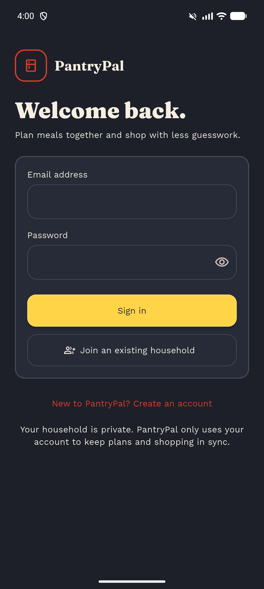
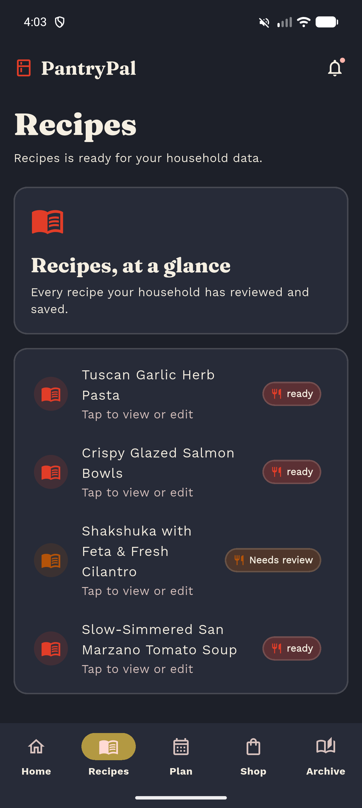
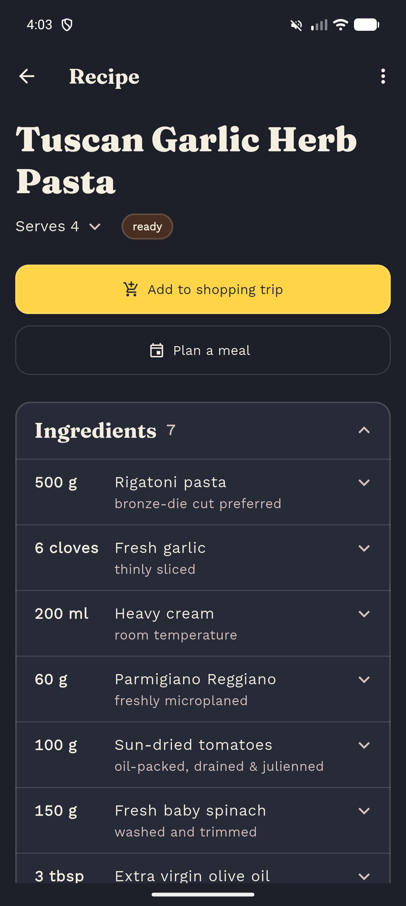
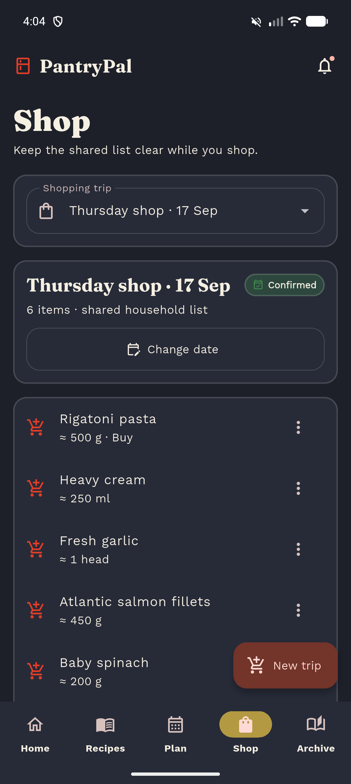
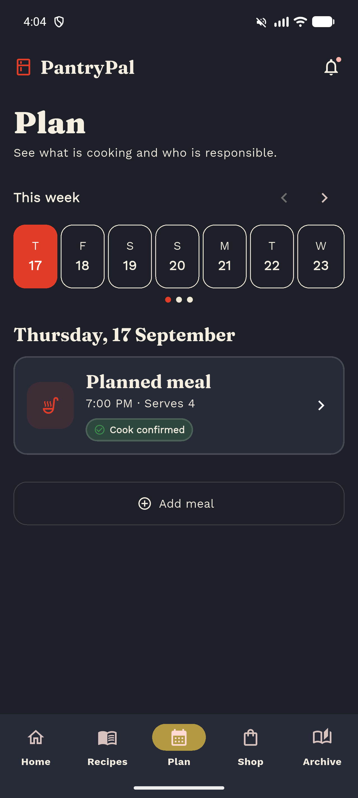
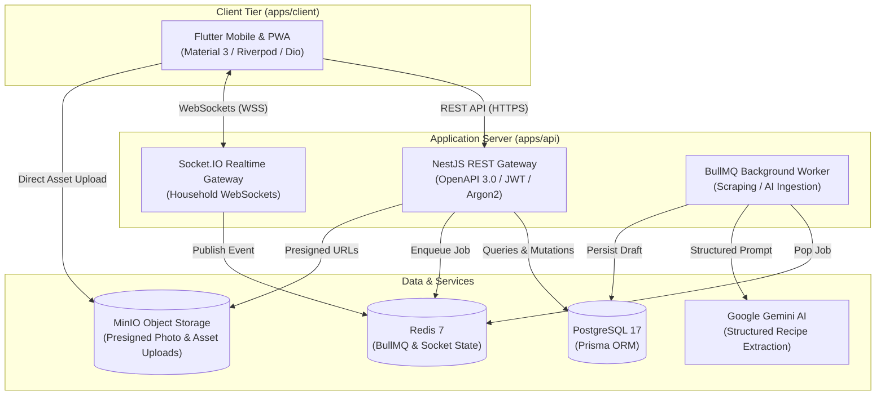

# PantryPal

<div align="center">


**An invite-only, real-time household culinary operations platform.**  
*Turns unformatted recipe links and shared media into reviewable recipes, dimension-aware unit estimates, coordinated shopping trips, pantry checks, and an immutable cooking archive.*

</div>

---

## Table of Contents

- [Overview & Problem Statement](#overview--problem-statement)
- [Mobile & Client Showcase](#mobile--client-showcase)
- [Core Engineering Highlights](#core-engineering-highlights)
  - [1. Dynamic Unit Estimation & Ingredient Math](#1-dynamic-unit-estimation--ingredient-math)
  - [2. Multi-Modal Ingestion & AI Worker Pipeline](#2-multi-modal-ingestion--ai-worker-pipeline)
  - [3. Real-Time Household State Synchronization](#3-real-time-household-state-synchronization)
  - [4. Contract-Driven Type Safety](#4-contract-driven-type-safety)
  - [5. "Diner Board" Material 3 Design System](#5-diner-board-material-3-design-system)
- [System Architecture](#system-architecture)
- [Technology Matrix](#technology-matrix)
- [Production Release & Build](#production-release--build)
- [Local Development & Getting Started](#local-development--getting-started)
- [Testing & Quality Assurance](#testing--quality-assurance)
- [Operator Commands](#operator-commands)

---

## Overview & Problem Statement

Modern household meal management suffers from fragmented workflows: recipes exist as arbitrary blog links, cooking videos, or handwritten notes; shopping trips rely on disorganized text lists that duplicate ingredients across meals; and past cooking history is lost to memory.

**PantryPal** resolves this by operating as a synchronized, full-lifecycle household kitchen engine:
1. **Intelligent Ingestion:** Extracts recipes from raw URLs or photos into structured, review-first recipe drafts using headless extraction and LLM parsing.
2. **Dynamic Scaling & Unit Math:** Aggregates required ingredients across planned meals, converts culinary measurements across dimensional units (`MASS`, `VOLUME`, `COUNT`), subtracts pantry reserves, and rounds to commercial packaging sizes.
3. **Trip Coordination:** Groups meals into scheduled shopping runs with state transitions (`PROPOSED` &rarr; `CONFIRMED` &rarr; `IN_PROGRESS` &rarr; `COMPLETED`) and real-time item check-offs.
4. **Cooking Archive:** Freezes executed meals as immutable historical snapshots, complete with cooking notes and photo covers, ensuring future recipe edits never mutate cooking history.

---

## Mobile & Client Showcase

The mobile application is engineered in Flutter with responsive layouts for Android and PWA web surfaces. Below are production captures from an Android physical device / emulator:

| 1. Invite-Only Auth | 2. Recipe Catalog | 3. Scaled Recipe Detail |
|:---:|:---:|:---:|
|  |  |  |
| *Cryptographic token validation, Diner Board dark theme, secure session storage.* | *Dynamic readiness status badges (`ready`, `Needs review`), quick search, tag filtering.* | *Yield/servings scaler, trip assignment guard, metric ingredient breakdowns, preparation notes.* |

<br />

| 4. Shared Shopping Trip & Unit Estimates | 5. 3-Week Meal Planner |
|:---:|:---:|
|  |  |
| *Multi-meal ingredient aggregation, dimension-aware buy amounts (`≈ 500 g`, `1 head`), real-time item status.* | *Interactive date strip, cook assignment workflows, confirmed schedule status.* |

---

## Core Engineering Highlights

### 1. Dynamic Unit Estimation & Ingredient Math
Unlike naive grocery apps that concatenate string names, PantryPal implements a dimension-aware mathematical pipeline:
- **Dimensional Classification:** Ingredients are normalized into dimensions: `MASS` (grams, kg, oz, lbs), `VOLUME` (ml, l, cups, tbsp, tsp), and `COUNT` (pieces, heads, cloves, cans).
- **Multi-Meal Aggregation:** When multiple recipes are assigned to a shopping trip, identical ingredient keys are merged across distinct recipes while preserving recipe-level provenance.
- **Pantry Remainder Deduction:** Existing pantry items can be subtracted from total recipe requirements.
- **Packaging Estimation:** The backend calculates expected retail buy quantities (`buyCount` &times; `buySize`) with remainder tracking (e.g. 350g requirement &rarr; Buy 1 &times; 500g package with 150g remainder).

### 2. Multi-Modal Ingestion & AI Worker Pipeline
- **Asynchronous Queue:** Recipe imports run asynchronously through BullMQ backed by Redis, isolating compute-intensive scraping and AI inference from the user-facing REST API.
- **Multi-Tier Scraping:** Supports standard JSON-LD / Microdata parsing with fallbacks to HTML readability extraction and media analysis.
- **LLM-Powered Extraction:** Structured JSON parsing through Google Gemini (`gemini-3.6-flash`), extracting title, yield, prep/cook times, and normalized ingredient lines.
- **Human-in-the-Loop Review:** Imported recipes are tagged `NEEDS_REVIEW` until an operator or household member reviews the parsed ingredients and instructions against source evidence.

### 3. Real-Time Household State Synchronization
- **WebSocket Gateway:** Full duplex communication via Socket.IO keeps all household members synchronized during planning and shopping.
- **Domain Event Dispatching:** Dispatches focused events (`shopping_item.changed`, `trip.changed`, `cooking.changed`, `pantry.recheck_required`, `notification.created`).
- **Reactive Cache Invalidation:** The Flutter client leverages Riverpod's `ref.invalidate()` across dependent providers, ensuring shopping lists update instantly when a family member checks off an item in the supermarket aisle.

### 4. Contract-Driven Type Safety
- **Single Source of Truth:** API contracts are generated using NestJS Swagger decorators and exported as OpenAPI 3.0 specifications.
- **Automated Client Codegen:** The Dart API client (`apps/client/lib/generated/openapi`) is generated directly from the OpenAPI spec, eliminating handwritten DTO boilerplate.
- **CI Contract Drift Detection:** `npm run contract:check` guarantees in CI that committed OpenAPI specifications match the active backend implementation.

### 5. "Diner Board" Material 3 Design System
- **Editorial Aesthetic:** Inspired by heritage diners and recipe cards—palette composed of warm Cream (`#FFF7E8`), Paper (`#FFFFFF`), Tomato Red (`#E23D28`), Butter Yellow (`#FFD447`), Ink (`#23283B`), and Hunter Green (`#3E8E4C`).
- **Typographic System:** Display headers set in Fraunces serif paired with Work Sans geometric body typography.
- **Tabular Figures:** Culinary measurements and quantities utilize tabular numerical font features (`FontFeature.tabularFigures()`) for precision alignment in grocery checklists.
- **Full Dark & Light Themes:** Adaptive contrast and token scales complying with WCAG AA standards.

---

## System Architecture



---

## Technology Matrix

| Layer | Technologies | Key Libraries & Tooling |
|---|---|---|
| **Mobile & Web Client** | Flutter 3.44.4, Dart 3.4+ | `flutter_riverpod`, `go_router`, `dio`, `flutter_secure_storage`, `google_fonts`, `socket_io_client`, `intl` |
| **Backend & Worker** | Node.js 26, NestJS, TypeScript | `@nestjs/core`, `@nestjs/swagger`, `bullmq`, `prisma`, `argon2`, `socket.io`, `@google/genai` |
| **Databases & Cache** | PostgreSQL 17, Redis 7 | `prisma-client`, `ioredis` |
| **Media & Storage** | MinIO (AWS S3 compatible) | `@aws-sdk/client-s3`, `ffmpeg`, `ffprobe` |
| **Contract & Verification** | OpenAPI 3.0, Jest, Flutter Test | `openapi-generator-cli`, `jest`, `supertest`, `flutter_test` |

---

## Production Release & Build

The Flutter client compiles to an optimized, tree-shaken Android APK configured for production deployment via Dart environment variables:

```bash
# From apps/client:
flutter build apk --release \
  --dart-define=API_BASE_URL=pantrypal.adamzborovsky.com/v1/
```

- **Output Location:** `apps/client/build/app/outputs/flutter-apk/app-release.apk`
- **Normalization:** The client automatically normalizes host definitions, ensuring missing schemes (`https://`) and trailing slashes are cleanly sanitized prior to initializing HTTP and WebSocket connections.
- **Install to Connected Device:**
  ```bash
  adb install -r build/app/outputs/flutter-apk/app-release.apk
  ```

---

## Local Development & Getting Started

### Prerequisites

- **Node.js:** v26+ and `npm`
- **Flutter SDK:** 3.44.4+
- **Docker Desktop:** For PostgreSQL, Redis, and MinIO
- **FFmpeg & FFprobe:** Installed on PATH

### 1. Clone & Configure Environment

```bash
git clone https://github.com/Adam-Zborovsky/PantryPal.git
cd PantryPal

# Copy environment variables
cp .env.example .env
```

### 2. Start Storage Containers

```bash
# Start PostgreSQL (5432), Redis (6379), and MinIO (9000/9001)
docker compose -f docker-compose.dev.yml up -d
```

### 3. Install Dependencies & Migrate Database

```bash
# Backend dependencies and Prisma migrations
cd apps/api
npm ci
npx prisma migrate dev

# Client dependencies
cd ../client
flutter pub get
```

### 4. Run Development Services

In separate terminal windows:

```bash
# Terminal 1: API Server (port 3001)
cd apps/api
npm run start:dev

# Terminal 2: Background Ingestion Worker
cd apps/api
npm run start:worker

# Terminal 3: Flutter Client (Web or Android)
cd apps/client
flutter run -d chrome --dart-define=API_BASE_URL=http://localhost:3001/v1
# For Android Emulator:
flutter run -d emulator-5554 --dart-define=API_BASE_URL=http://10.0.2.2:3001/v1
```

---

## Testing & Quality Assurance

The codebase enforces strict end-to-end type safety, behavioral tests, and drift verification:

```bash
# Run NestJS API unit and integration tests
cd apps/api
npm test -- --runInBand

# Run NestJS End-to-End test suite
npm run test:e2e -- --runInBand

# Run Flutter client widget and unit tests (89 passing tests)
cd ../client
flutter test

# Verify OpenAPI contract has no uncommitted drift
cd ../api
npm run contract:check
```

---

## Operator Commands

PantryPal uses cryptographic invite-only access control. Use the operator CLI to manage beta tokens and account credentials:

```bash
# Generate a one-time cryptographic beta invite token (default 30-day validity):
cd apps/api
npm run cli -- beta-invite 30

# Reset an account password and invalidate all existing sessions:
npm run cli -- reset-password <user-email> <new-password-min-12-chars>
```

---

<div align="center">
  <sub>Crafted with care for shared household kitchens.</sub>
</div>
